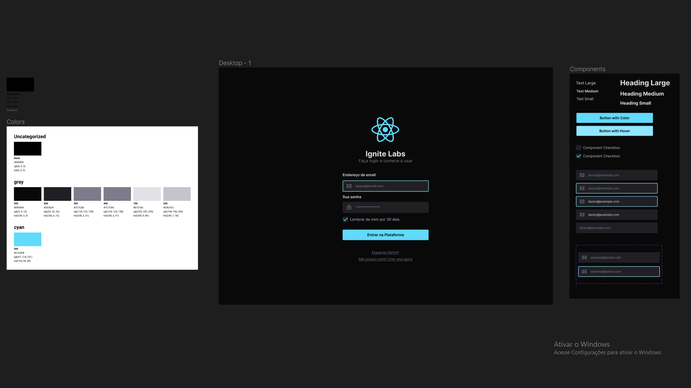
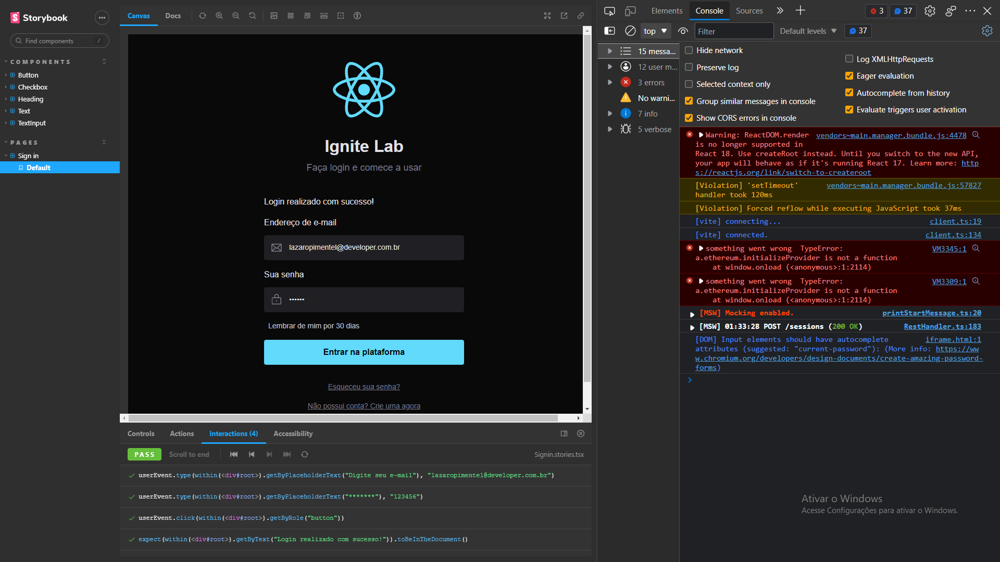

# React-Design-System

Projeto desenvolvido durante o Ignite Lab, uma página de login - React com Design System integrado com storybook.

*   Figma
*   Tailwind
*   Storybook
*   Jest-libray integrado ao Storybook
*   Mock

******

## Figma

Foi desenvolvido um projeto em Figma aplicando os conceitos de Design System, criando e separando os componentes, criando e usando o guia de cores.

[Link do projeto no Figma (Clique aqui)](https://www.figma.com/file/4YTij7271gHYZ9smKkImak/Untitled?node-id=0%3A1)

O Token de cores desenvolvido no Figma foi utilizado para o desenvolvimento do projeto

******

## Tailwind

Bibliteca de estilização semelhante ao Bootstrap.

*****

## Storybook

Ferramente que permite criar componentes em ambiente isolado. 

Foi desenvolvido componentes com variabilidade e propriedades.

Adicionada Acessibilidade dos components

[Link do Deploy do Storybook (Clique aqui)](https://drlazinho.github.io/react-design-system/?path=/story/components-button--default)

******

## Testes

Os testes foram integrado com Storkbook.

Foi utilizado o mock testar a aplicação em simulação a um backend.

******

### Documentações

[Aplicando storybook no vite](https://storybook.js.org/blog/storybook-for-vite/)

[CLSX](https://www.npmjs.com/package/clsx) - Ferramentas para construção de `className` condicionais.

[Radix-ui](https://www.radix-ui.com/docs/primitives/overview/introduction)

[Storybook Deployer](https://github.com/storybookjs/storybook-deployer)

[Accessibility Storybook](https://storybook.js.org/addons/@storybook/addon-a11y)

[Storybook Addon Interactions](https://storybook.js.org/addons/@storybook/addon-interactions)

[Mock Service Worker](https://mswjs.io/)

[msw-storybook-addon](https://github.com/mswjs/msw-storybook-addon)

#### Site - Ferramenta

[Transform Tools](https://transform.tools/) - tranforma código. Neste projeto foi utilizado o código svg transformado para um function em react.